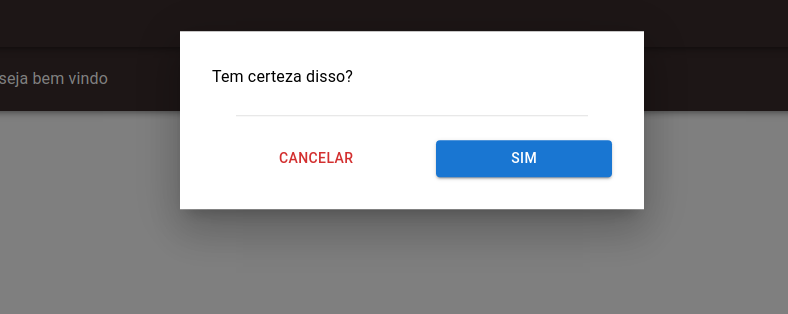
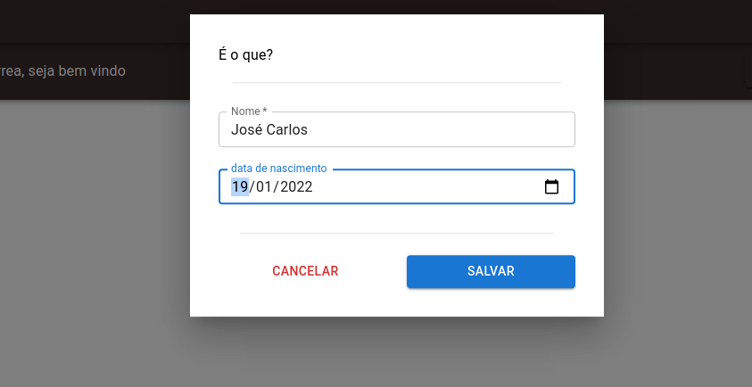
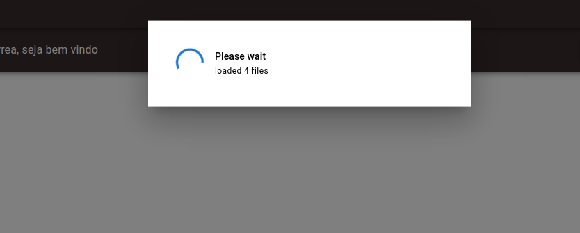

# react-promise-window
tool for custom dialogs for front end react js fully promise window
this package was built with material framework v5, which uses imports like @mui/material

## Install
 - yarn
``` bash
yarn add react-mui-window
```

 - npm
``` bash
npm i react-mui-window
```

## Promisses
all functions are made with promises, so use .then() for 'ok' or .catch() for 'cancelers'

### Confirm 
custom confirmation screen

``` js 
    window.Alert("Só pra avisar", 5000) // timeout 5seg
        .then( response => {
            console.log(response); // true
    });
```



### Prompt
 - Multiple text entries can be added by prompt, include as many inputs as you want

``` js
window.Prompt("É o que?", [
    {label: 'Nome', name: 'name', type: 'text' },
    {label: 'data de nascimento', name: 'date', type: 'date', optional: true}
])
.then( data => {
    console.log(data); // {name: 'José Carols', date: '2022-01-19'}
})
.catch( () => {
    console.log("user canceled")
})
```



### Loading
- custom loading screen with or without text

``` js
window.Loading("Please wait", "loaded " + (i++) + " files"); // to open
window.Loading(false); // to close

/**
 * @example
 */
import Button from '@mui/material/Button';

<Button
    variant="contained"
    onClick={() => {
        let i = 0;
        const interval = setInterval(() => {
            window.Loading("Please wait", "loaded " + (i++) + " files");
        }, 1000)
        setTimeout(() => {
            window.Loading(false);
            clearInterval(interval);
        }, 10000);
    }}>
    Click to open
</Button>

```



